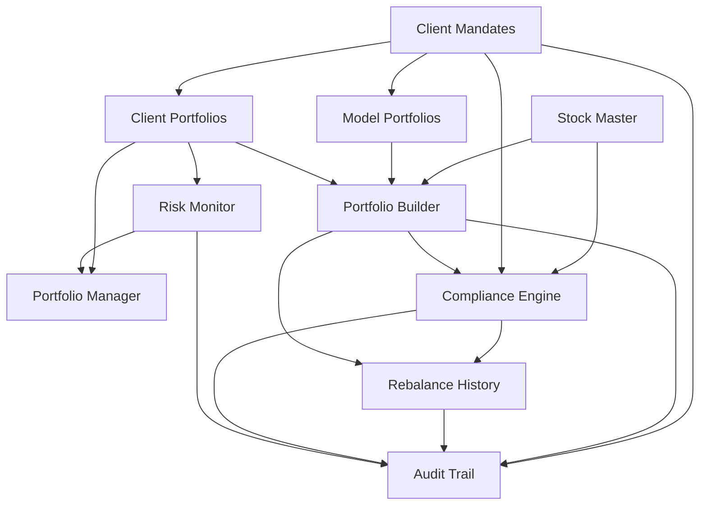

# 02 — Phase 1 Modules (Master Spec)

Detailed per-module files live under [`modules/`](./modules/). This document is the cross-module map: dependencies, UI surfaces, and backend ownership.

---

## Module dependency graph

**Build order (single developer):** Stock Master tags → Mandates → Cash/NAV on Client Portfolios → Eligibility + Compliance engine → Risk engine → Portfolio Manager cockpit → Portfolio Builder → Rebalance History → Audit UI polish.

---

## Module summary table

| # | Module | Backend ownership | Frontend routes (proposed) | Depends on |
|---|--------|-------------------|----------------------------|------------|
| 1 | Client Mandates | `mandates` (+ extend `customers`) | `/clients`, `/clients/:id/mandate` | Users/roles |
| 2 | Stock Master | extend `stocks` | `/stocks` (enhanced) | Indices for QERI/DSM |
| 3 | Portfolio Manager | aggregations over portfolios | `/portfolios` or enhance `/` | Risk, Compliance, CP |
| 4 | Client Portfolios | extend `portfolios` + cash | `/clients/:id` (enhance CustomerDetail) | Mandates, holdings |
| 5 | Portfolio Builder | `model_portfolios`, `builder_sessions` | `/builder`, `/builder/:id` | SM, Mandates, Compliance |
| 6 | Rebalance History | `rebalances` + snapshots | `/rebalances`, `/rebalances/:id` | Builder, Compliance |
| 7 | Compliance | `compliance_checks`, `exceptions` | `/compliance` | SM, Mandates, limits |
| 8 | Risk Monitor | `risk_alerts` | `/risk` + embeds | Holdings, prices, IPS rules |
| 9 | Audit Trail | `audit_logs` | `/audit` | All mutating modules |

---

## Shared domain services (backend)

| Service | Responsibility |
|---------|----------------|
| `eligibility.ts` | Mandate × stock → allow/deny |
| `mandate-rules.ts` | Benchmark mapping, model type, universe groups |
| `compliance-engine.ts` | Run check suite; return structured results |
| `risk-engine.ts` | Scan portfolios; upsert alerts |
| `holdings.ts` / extend `calculations.ts` | Holdings, weights, NAV, cash |
| `rebalance-snapshots.ts` | Before/after JSON snapshots |
| `proposed-trades.ts` | Diff current vs target → trade list |
| `audit.ts` | Append-only audit writer (used by all routes) |
| `approvals.ts` | Status transitions with role checks |

---

## Navigation (Phase 1 target)

Replace / extend current Shell nav:

| Group | Items |
|-------|-------|
| Overview | Dashboard (firm) · Portfolio Manager |
| Clients | Clients & Mandates · Client Portfolio detail |
| Markets | Stocks (master) · Indices |
| Construction | Portfolio Builder · Rebalance History |
| Control | Compliance · Risk Monitor · Audit |
| Research (existing, keep) | Sectors (AI) — not Phase 1 scope but retain |

---

## Model portfolios (supporting Phase 1, required by Builder)

Not listed as a separate Blueprint §20 bullet, but §7 makes them mandatory for Builder:

| Model key | Universe | Benchmark | Construction |
|-----------|----------|-----------|--------------|
| FS_MED | A | QERI | 65/35 core-satellite |
| SP_MED | A+B | QERI | 65/35 |
| UN_MED | A+B+C | DSM | 65/35 |
| FS_HIGH | A | QERI ref | Full active |
| SP_HIGH | A+B | QERI ref | Full active |
| UN_HIGH | A+B+C | DSM ref | Full active |

Seed these six system models; clients link to one based on mandate.

---

## Integration with existing features

| Existing | Phase 1 treatment |
|----------|-------------------|
| Transactions BUY/SELL | Remain source of holdings; Builder proposes trades — applying them may be “record proposed” or “apply as txs with compliance gate” (prefer apply with gate for operational usefulness) |
| Corporate actions | Keep; not Phase 1 delivery item |
| Sector AI | Keep under Research; no Phase 1 dependency |
| Admin user | Expand to multi-user RBAC |

---

## Definition of “module complete”

A module is complete when:

1. Schema migrated and seeded where needed  
2. API covered with authz  
3. UI reachable from nav  
4. Business rules from BUSINESS-RULES.md enforced server-side  
5. Audit events written  
6. Acceptance tests / UAT checklist items for that module pass  

See individual files in [`modules/`](./modules/).
