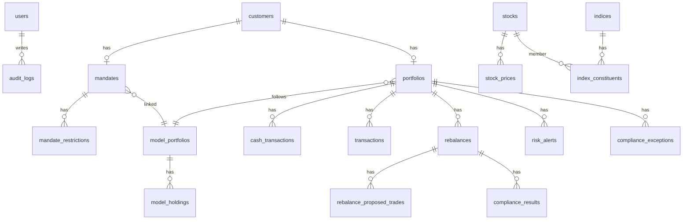

# 03 — Database Schema (Phase 1)

**ORM:** Drizzle · **DB:** PostgreSQL 16  
**Strategy:** Evolve existing `src/db/schema/index.ts`; add new schema files; generate migrations. Do not drop production data.

Related: [11-DATA-MIGRATION.md](./11-DATA-MIGRATION.md)

---

## 1. Design principles

1. **Single source of truth** — prices, holdings (via txs), cash, mandates, models, rebalances, risk, compliance, audit in Postgres.  
2. **Append-only audit** — `audit_logs` has no update/delete from app.  
3. **Immutable finals** — rebalance rows with `lock_status = final` cannot be updated; corrections go to `rebalance_corrections`.  
4. **Numeric money** — `numeric(18,4)` for QAR amounts; `numeric(12,8)` for weights/ratios.  
5. **Enums** for fixed IPS vocabularies.  
6. **JSON snapshots** for before/after rebalance payloads (queryable via `jsonb`).

---

## 2. Entity-relationship (Phase 1)



---

## 3. Enums (new / extended)

```sql
-- Users / security
CREATE TYPE user_role AS ENUM ('admin', 'pm', 'compliance', 'approver', 'viewer');
CREATE TYPE user_status AS ENUM ('active', 'disabled');

-- Mandates
CREATE TYPE mandate_type AS ENUM ('discretionary');
CREATE TYPE shariah_preference AS ENUM ('fully_shariah', 'shariah_purifying', 'unrestricted');
CREATE TYPE risk_profile AS ENUM ('medium', 'high');
CREATE TYPE mandate_approval_status AS ENUM ('pending', 'approved', 'amended', 'closed');
CREATE TYPE restriction_type AS ENUM ('stock', 'sector', 'other');

-- Stocks
CREATE TYPE shariah_group AS ENUM ('A', 'B', 'C');
CREATE TYPE regulatory_status AS ENUM ('clear', 'watch', 'restricted', 'suspended');

-- Models / builder
CREATE TYPE construction_style AS ENUM ('core_satellite', 'full_active');
CREATE TYPE model_status AS ENUM ('draft', 'active', 'retired');
CREATE TYPE builder_target_type AS ENUM ('model', 'client');

-- Rebalance
CREATE TYPE rebalance_trigger AS ENUM (
  'quarterly_review', 'benchmark_change', 'active_review',
  'breach', 'cash_deposit', 'cash_withdrawal', 'ad_hoc'
);
CREATE TYPE rebalance_lock_status AS ENUM (
  'draft', 'approved', 'executed', 'final', 'cancelled'
);

-- Compliance / risk
CREATE TYPE compliance_timing AS ENUM ('before_proposal', 'before_trade', 'after_trade');
CREATE TYPE check_result AS ENUM ('pass', 'fail', 'warning');
CREATE TYPE exception_status AS ENUM ('requested', 'approved', 'rejected', 'expired', 'used');
CREATE TYPE risk_alert_type AS ENUM (
  'stock_weight_15', 'stock_weight_20',
  'sector_weight_35', 'sector_weight_40',
  'stock_loss_15', 'stock_loss_25', 'stock_loss_30',
  'underperform_3m', 'excess_cash', 'liquidity', 'regulatory'
);
CREATE TYPE alert_severity AS ENUM ('info', 'warning', 'critical');
CREATE TYPE alert_status AS ENUM ('open', 'in_progress', 'resolved', 'waived');

-- Cash
CREATE TYPE cash_tx_type AS ENUM ('deposit', 'withdrawal', 'fee', 'dividend', 'adjustment');

-- Audit
CREATE TYPE audit_action AS ENUM (
  'create', 'update', 'delete', 'approve', 'reject',
  'status_change', 'override', 'login', 'export', 'correction'
);
```

---

## 4. Tables — security (replace thin `admins`)

### `users` (migrate from `admins`)

| Column | Type | Notes |
|--------|------|-------|
| id | uuid PK | |
| username | varchar(100) unique | |
| password_hash | varchar(255) | |
| display_name | varchar(200) | |
| role | user_role | |
| status | user_status | default active |
| created_at / updated_at | timestamptz | |

Keep `admins` temporarily or migrate 1:1 → `users` with role `admin`. Prefer rename via migration.

---

## 5. Tables — clients & mandates

### `customers` (extend existing)

| Column | Type | Notes |
|--------|------|-------|
| id, name, email, join_date, created_at | existing | |
| account_number | varchar(50) | optional external account |
| portfolio_manager_id | uuid → users | owning PM |
| notes | text | |

### `mandates`

| Column | Type | Notes |
|--------|------|-------|
| id | uuid PK | |
| customer_id | uuid unique → customers | 1:1 for Phase 1 |
| mandate_type | mandate_type | default discretionary |
| shariah_preference | shariah_preference | not null |
| risk_profile | risk_profile | not null |
| benchmark_index_id | uuid → indices | enforced by rules |
| model_portfolio_id | uuid → model_portfolios | nullable until linked |
| approval_status | mandate_approval_status | default pending |
| approved_by | uuid → users | |
| approved_at | timestamptz | |
| effective_from | date | |
| effective_to | date | nullable |
| created_at / updated_at | timestamptz | |

### `mandate_restrictions`

| Column | Type | Notes |
|--------|------|-------|
| id | uuid PK | |
| mandate_id | uuid → mandates | |
| restriction_type | restriction_type | |
| stock_id | uuid nullable | |
| sector | varchar(100) nullable | |
| description | text | |
| is_active | boolean | default true |

### `mandate_status_history`

| Column | Type | Notes |
|--------|------|-------|
| id | uuid PK | |
| mandate_id | uuid | |
| from_status / to_status | mandate_approval_status | |
| changed_by | uuid → users | |
| reason | text | |
| changed_at | timestamptz | |

---

## 6. Tables — stock master (extend `stocks`)

### `stocks` new columns

| Column | Type | Notes |
|--------|------|-------|
| shariah_group | shariah_group | nullable until backfilled; then not null |
| is_qeri_member | boolean | default false |
| is_dsm_member | boolean | default false |
| avg_daily_traded_value | numeric(18,4) | QAR |
| is_illiquid | boolean | generated or maintained: ADTV < 100000 |
| regulatory_status | regulatory_status | default clear |
| regulatory_notes | text | |
| is_tradable | boolean | default true |
| updated_at | timestamptz | |

### `index_constituents`

| Column | Type | Notes |
|--------|------|-------|
| id | uuid PK | |
| index_id | uuid → indices | QERI / DSM |
| stock_id | uuid → stocks | |
| weight | numeric(12,8) | benchmark weight |
| effective_date | date | |
| Unique | (index_id, stock_id, effective_date) | |

Existing: `stock_prices`, `adjusted_prices`, `corporate_actions`, `indices`, `index_data_points` — keep.

---

## 7. Tables — portfolios & cash

### `portfolios` (extend)

| Column | Type | Notes |
|--------|------|-------|
| existing | id, customer_id unique, name, benchmark_index_id, created_at | |
| model_portfolio_id | uuid → model_portfolios | current target model |
| base_currency | varchar(3) | default QAR |
| cash_balance | numeric(18,4) | denormalized cache; source = cash ledger |
| inception_date | date | |
| status | varchar | active / closed |
| updated_at | timestamptz | |

> Phase 1 keeps **1 portfolio per customer**. Multi-portfolio-per-client is a later change.

### `cash_transactions`

| Column | Type | Notes |
|--------|------|-------|
| id | uuid PK | |
| portfolio_id | uuid → portfolios | |
| type | cash_tx_type | |
| amount | numeric(18,4) | signed or positive + type |
| trade_date | date | |
| value_date | date | |
| reference | varchar(100) | |
| notes | text | |
| created_by | uuid → users | |
| created_at | timestamptz | |

### `transactions` (extend lightly)

| Column | Type | Notes |
|--------|------|-------|
| price | numeric(20,10) | blotter unit cost; import uses Buy/Sell Value ÷ qty (0017) |
| rebalance_id | uuid nullable → rebalances | link when applied from rebalance |
| commission | numeric(18,4) | optional Phase 1 |
| notes | text | |

---

## 8. Tables — models & builder

### `model_portfolios`

| Column | Type | Notes |
|--------|------|-------|
| id | uuid PK | |
| code | varchar(32) unique | e.g. FS_MED |
| name | varchar(200) | |
| shariah_preference | shariah_preference | |
| risk_profile | risk_profile | |
| benchmark_index_id | uuid → indices | |
| construction_style | construction_style | |
| core_weight | numeric(8,4) | 0.65 or 0 for full active |
| satellite_weight | numeric(8,4) | 0.35 or 1 |
| status | model_status | |
| version | int | |
| created_at / updated_at | timestamptz | |

### `model_holdings`

| Column | Type | Notes |
|--------|------|-------|
| id | uuid PK | |
| model_portfolio_id | uuid | |
| stock_id | uuid | |
| target_weight | numeric(12,8) | |
| sleeve | varchar(20) | core / satellite / active |
| Unique | (model_portfolio_id, stock_id) | |

### `builder_sessions`

| Column | Type | Notes |
|--------|------|-------|
| id | uuid PK | |
| target_type | builder_target_type | model \| client |
| model_portfolio_id | uuid nullable | |
| portfolio_id | uuid nullable | client portfolio |
| mandate_id | uuid nullable | |
| status | varchar | drafting / reviewed / converted |
| payload | jsonb | working weights, UI state |
| created_by | uuid → users | |
| created_at / updated_at | timestamptz | |

---

## 9. Tables — rebalance history

### `rebalances`

| Column | Type | Notes |
|--------|------|-------|
| id | uuid PK | |
| rebalance_code | varchar(40) unique | human ID e.g. RB-2026-00042 |
| portfolio_id | uuid nullable | client rebalance |
| model_portfolio_id | uuid nullable | model-level change |
| trigger | rebalance_trigger | |
| lock_status | rebalance_lock_status | |
| proposed_at | timestamptz | |
| approved_at | timestamptz | |
| executed_at | timestamptz | Phase 2 fill |
| finalized_at | timestamptz | |
| prepared_by / reviewed_by / approved_by | uuid → users | |
| before_snapshot | jsonb | holdings, weights, sectors, cash, NAV, metrics |
| after_snapshot | jsonb | |
| target_allocation | jsonb | |
| compliance_summary | jsonb | rollup |
| allocation_method | varchar | stub: pro_rata / model / cash / exception |
| documents | jsonb | file refs / notes |
| notes | text | |
| created_at / updated_at | timestamptz | |

### `rebalance_proposed_trades`

| Column | Type | Notes |
|--------|------|-------|
| id | uuid PK | |
| rebalance_id | uuid | |
| stock_id | uuid | |
| side | varchar | BUY / SELL |
| quantity | numeric(18,4) | |
| estimated_price | numeric(18,4) | |
| estimated_value | numeric(18,4) | |
| reason | text | |
| compliance_result | check_result | |

### `rebalance_corrections`

| Column | Type | Notes |
|--------|------|-------|
| id | uuid PK | |
| rebalance_id | uuid | only when final |
| field_path | text | |
| old_value / new_value | jsonb | |
| reason | text | |
| corrected_by | uuid | |
| corrected_at | timestamptz | |

---

## 10. Tables — compliance & risk

### `compliance_check_definitions` (seed)

| Column | Type | Notes |
|--------|------|-------|
| id | uuid / code PK | |
| code | varchar unique | e.g. SHARIAH_UNIVERSE |
| name | text | |
| timing | compliance_timing | |
| is_active | boolean | |

### `compliance_results`

| Column | Type | Notes |
|--------|------|-------|
| id | uuid PK | |
| rebalance_id | uuid nullable | |
| portfolio_id | uuid | |
| check_code | varchar | |
| timing | compliance_timing | |
| result | check_result | |
| reason_code | varchar | |
| message | text | |
| details | jsonb | |
| created_at | timestamptz | |

### `compliance_exceptions`

| Column | Type | Notes |
|--------|------|-------|
| id | uuid PK | |
| portfolio_id | uuid | |
| check_code | varchar | |
| reason | text | |
| status | exception_status | |
| requested_by / approved_by | uuid | |
| valid_until | date | |
| created_at / updated_at | timestamptz | |

### `risk_alerts`

| Column | Type | Notes |
|--------|------|-------|
| id | uuid PK | |
| portfolio_id | uuid | |
| alert_type | risk_alert_type | |
| severity | alert_severity | |
| status | alert_status | |
| stock_id | uuid nullable | |
| sector | varchar nullable | |
| metric_value | numeric | e.g. weight 0.22 |
| threshold | numeric | |
| due_date | date | from IPS timelines |
| owner_id | uuid → users | |
| resolution_notes | text | |
| opened_at / resolved_at | timestamptz | |
| Unique open | partial unique on (portfolio_id, alert_type, stock_id, sector) WHERE status open | |

### `ips_limit_config` (seed, editable by admin)

| Column | Type | Notes |
|--------|------|-------|
| key | varchar PK | e.g. stock_soft_weight |
| value | numeric | 0.15 |
| unit | varchar | ratio / days / qar |
| description | text | |

---

## 11. Tables — audit & health

### `audit_logs`

| Column | Type | Notes |
|--------|------|-------|
| id | uuid PK / bigserial | prefer uuid |
| occurred_at | timestamptz | default now |
| user_id | uuid nullable | |
| action | audit_action | |
| object_type | varchar | mandate, stock, rebalance, … |
| object_id | uuid | |
| old_value | jsonb | |
| new_value | jsonb | |
| reason | text | |
| ip_address | varchar | optional |
| request_id | varchar | optional |

**No UPDATE/DELETE grants to app role** (or enforce in service layer).

### `system_health_snapshots` (optional Phase 1)

| Column | Type | Notes |
|--------|------|-------|
| id | uuid | |
| checked_at | timestamptz | |
| db_ok | boolean | |
| last_price_date | date | |
| details | jsonb | |

---

## 12. Tables left unchanged (Phase 1)

- `sector-intel.ts` tables (`sectors`, `news_articles`, …) — out of Phase 1 scope  
- Core price/CA machinery  

---

## 13. Suggested Drizzle file layout

```
src/db/schema/
  index.ts              # re-exports
  users.ts
  customers-mandates.ts # customers extend + mandates
  stocks.ts             # moved/extended stocks
  portfolios.ts         # portfolios, cash, transactions
  models-builder.ts
  rebalances.ts
  compliance-risk.ts
  audit.ts
  sector-intel.ts       # existing
```

---

## 14. Seed data required for Phase 1

1. Roles users: admin, pm, compliance, approver (passwords via env/seed)  
2. Indices: DSM, QERI (if not present)  
3. Six model portfolios (FS_MED … UN_HIGH) empty holdings  
4. IPS limit config rows (15/20/35/40%, loss ladders, ADTV 100000)  
5. Compliance check definitions  
6. Migrate existing admin → users  

---

## 15. Indexes (critical)

- `stocks (shariah_group)`, `(regulatory_status)`, `(is_illiquid)`  
- `mandates (approval_status)`, `(shariah_preference, risk_profile)`  
- `risk_alerts (portfolio_id, status)`, `(due_date)`  
- `rebalances (portfolio_id, lock_status)`, `(proposed_at)`  
- `audit_logs (occurred_at)`, `(object_type, object_id)`, `(user_id)`  
- `cash_transactions (portfolio_id, trade_date)`  
- `index_constituents (index_id, effective_date)`
- `ipms_client_snapshots (client_id, snapshot_date)` unique; `(snapshot_date)`; `(status)` — status includes `cash_only` when IPMS MV = 0  
