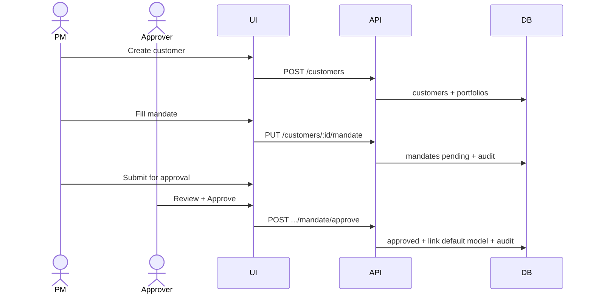
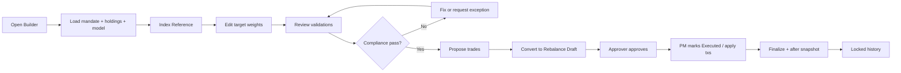

# 07 — Workflows (Phase 1)

---

## WF1 — Client onboarding to first approved mandate

**Exit criteria:** Mandate Approved; model linked; trading gates open.

---

## WF2 — Maintain stock master

1. Admin/PM uploads or edits stock classification (Group, QERI/DSM, ADTV, regulatory).  
2. System sets `is_illiquid` if ADTV < 100,000.  
3. Audit log written.  
4. Eligibility service uses new tags immediately.

---

## WF3 — Build / rebalance a client portfolio

---

## WF4 — Pre-proposal compliance

Input: portfolio, target allocation or proposed trades.  
Process: run check catalog (BUSINESS-RULES §6).  
Output: list of results; hard fails block convert/approve; warnings visible.

---

## WF5 — Risk breach lifecycle

1. Nightly or post-price `POST /risk/scan`.  
2. Alert created (e.g. stock 22% → `stock_weight_20`, due_date +10 trading days).  
3. Shows on Portfolio Manager + Client Portfolio + Risk page.  
4. Owner assigned; status in_progress.  
5. PM uses Builder to reduce weight → new rebalance.  
6. Resolve alert with link to rebalance id; audit.

---

## WF6 — Compliance exception

1. Fail on STOCK_LIMIT soft with index exception need.  
2. PM requests exception with reason + validity.  
3. Approver approves → status approved.  
4. Re-run compliance; exception satisfies EXCEPTION_REQUIRED.  
5. Exception marked used when rebalance approved.  
6. Full audit trail.

---

## WF7 — Cash deposit triggers review

1. POST cash deposit.  
2. Recalc cash/NAV; possibly open `excess_cash` alert.  
3. Optional: suggest rebalance trigger `cash_deposit`.  
4. Audit cash movement.

---

## WF8 — Daily control loop (ops)

| When | Action |
|------|--------|
| Live | Refresh prices; open Portfolio Manager; review Risk + Compliance queues |
| Per change | Builder → compliance → rebalance history |
| EOD | Risk scan; ensure no critical alert without owner |

(Weekly/monthly/quarterly IC procedures from Blueprint §19 mostly Phase 2 reporting.)

---

## WF9 — Correction of finalized rebalance

1. User with approver/admin opens Final rebalance.  
2. Cannot edit fields in place.  
3. POST correction with field path, old/new, reason.  
4. Audit + correction row.  
5. UI shows corrections panel.
