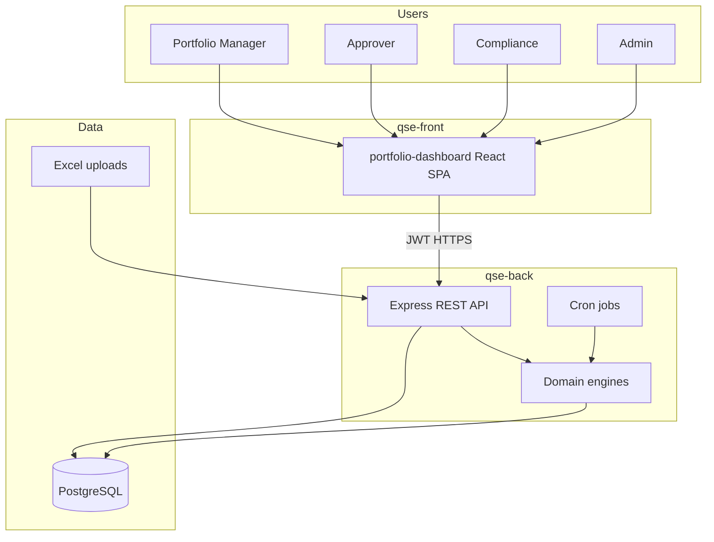

# 14 — Technical Architecture

---

## System context



---

## Stack (confirmed)

| Layer | Choice |
|-------|--------|
| Frontend | React 19, Vite, Tailwind 4, wouter, TanStack Query |
| Backend | Node.js, TypeScript ESM, Express 5 |
| ORM | Drizzle |
| DB | PostgreSQL 16 (Docker locally) |
| Auth | JWT + bcrypt |
| Files | Multer + xlsx |
| AI (existing) | Gemini — out of Phase 1 critical path |

---

## Backend package layout (target)

```
src/
  app.ts
  middleware/auth.ts          # + requireRole
  routes/
    auth.ts users.ts
    customers.ts mandates.ts  # or nested
    stocks.ts indices.ts
    portfolios.ts portfolio-manager.ts
    cash.ts
    models.ts builder.ts
    rebalances.ts
    compliance.ts risk.ts
    audit.ts
    dashboard.ts sectors.ts   # existing
  services/
    audit.ts
    eligibility.ts
    mandate-rules.ts
    compliance-engine.ts
    risk-engine.ts
    proposed-trades.ts
    rebalance-snapshots.ts
    calculations.ts           # extended
    ...
  db/schema/...
```

---

## Frontend layout (target)

```
src/
  pages/
    PortfolioManager.tsx
    Builder.tsx
    Rebalances.tsx RebalanceDetail.tsx
    Compliance.tsx Risk.tsx Audit.tsx
    ...existing
  components/
    mandate/ risk/ compliance/ builder/
  lib/api.ts AuthContext.tsx
```

---

## Cross-cutting patterns

1. **Transactional updates:** rebalance finalize + snapshot + audit in one DB transaction.  
2. **Idempotent risk scan:** upsert open alerts; don’t duplicate open rows.  
3. **Additive APIs:** never remove existing JSON fields without versioning.  
4. **Deterministic codes:** `rebalance_code`, reason codes, check codes.  
5. **Config over magic numbers:** IPS thresholds in `ips_limit_config`.

---

## Environments

| Env | Purpose |
|-----|---------|
| Local Docker PG | Dev |
| Staging | UAT with anonymized/realistic seed |
| Production | QSC — backups, restricted secrets |

---

## Testing strategy (Phase 1 practical)

| Type | Focus |
|------|-------|
| Unit | eligibility, weight math, compliance checks, risk thresholds |
| Integration | mandate approve gate on POST transaction |
| Manual UAT | [09-ACCEPTANCE-CRITERIA.md](./09-ACCEPTANCE-CRITERIA.md) |

Automate unit tests for engines first — highest regression risk.

---

## Documentation deliverables (PSA-aligned, Phase 1 subset)

| PSA deliverable | Phase 1 artifact |
|-----------------|------------------|
| Functional & technical design | This `plans/phase-1` folder |
| DB schema | `03-DATABASE-SCHEMA.md` + Drizzle migrations |
| API docs | `04-API-SPEC.md` (OpenAPI export optional later) |
| User-oriented | Short ops cheat-sheet after UAT (to write at M8) |
